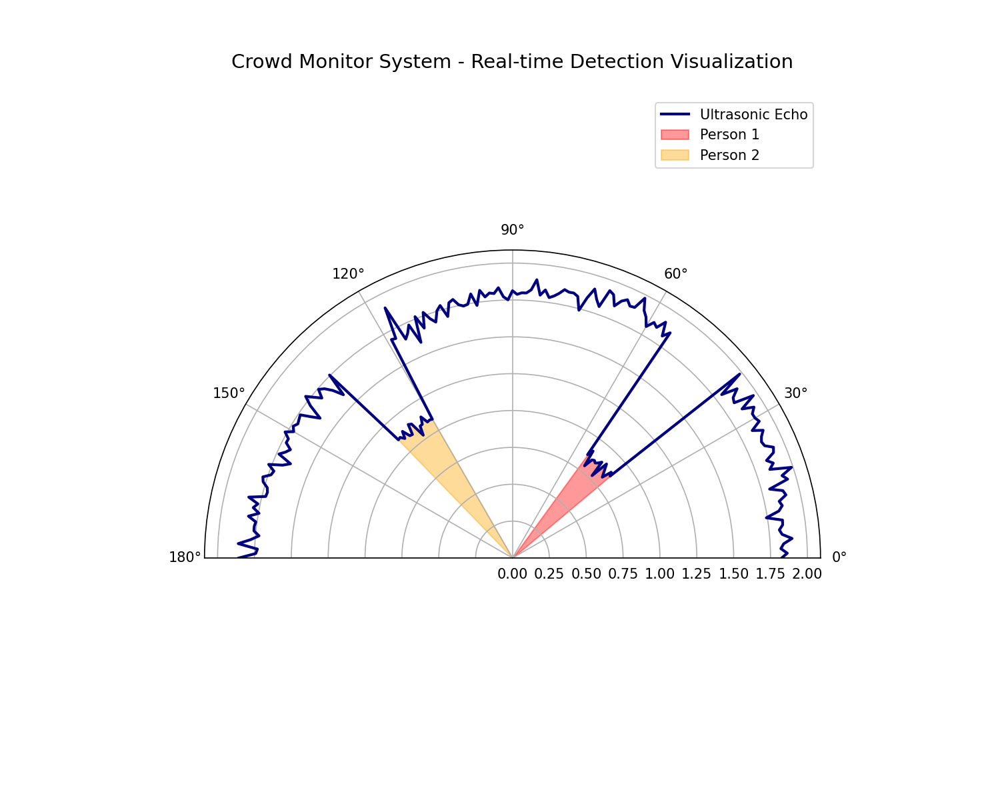

# Crowd Monitoring System with Ultrasonic Sweep & ML


A low-cost, effective solution for monitoring crowd density using an HC-SR04 ultrasonic sensor mounted on a servo motor, coupled with a Machine Learning backend for human detection and counting.

## 🚀 Overview

This project implements a "radar" style scanning system that uses ultrasonic pulses to map the environment within a 180° field of view. The raw distance data is processed by a Python-based ML pipeline that performs:
1. **DBSCAN Clustering**: Grouping raw data points into spatial clusters.
2. **Random Forest Classification**: Distinguishing between human and non-human (obstacles) clusters.
3. **Density Estimation**: Calculating people per square meter based on detected clusters.

## 📁 Repository Structure

- `firmware/`: Arduino/ESP32 source code for ultrasonic-servo sweep.
- `software/`: Python scripts for data collection, preprocessing, and real-time inference.
- `ml_model/`: Trained models (`.joblib`) and the training dataset.
- `results/`: Sample performance metrics and visualization graphs.
- `hardware/`: Wiring diagrams and component specifications.
- `docs/`: In-depth explanation of the working principle and project report.

## 🛠️ Hardware Requirements

- **Microcontroller**: Arduino Uno / ESP32 / ESP8266
- **Ultrasonic Sensor**: HC-SR04
- **Servo Motor**: SG90 or similar
- **Connection**: USB-Serial for data logging

## 💻 Software Stack

- **Firmware**: C++ (Arduino Framework)
- **Backend**: Python 3.9+
- **ML Libraries**: Scikit-Learn, NumPy, Joblib
- **Visualization**: Matplotlib

## 📊 Results

Sample detection output from the system:


*Accuracy metrics and logs can be found in the `results/` folder.*

## 🔧 Installation & Usage

1. **Firmware**: Flash `firmware/ultrasonic_servo_scan.ino` to your Arduino.
2. **Setup**: Install Python dependencies:
   ```bash
   pip install -r requirements.txt
   ```
3. **Run**: Start the real-time inference:
   ```bash
   python software/inference.py
   ```

## 📝 License
MIT License - See [LICENSE](LICENSE) for details.
